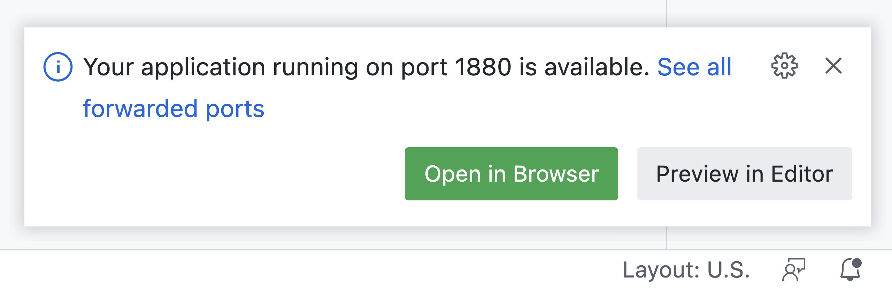
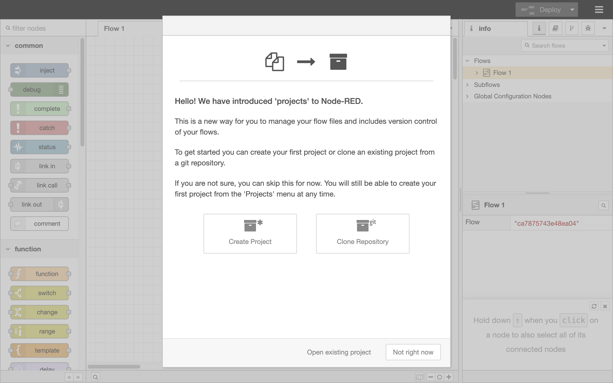

# Node-RED template for GitHub Codespaces

This repository is the template to create the Node-RED environment on GitHub Codespases.
Using the Codespases, you can temporality use the Node-RED flow editor for four hours.
This template will be useful to try Node-RED for hands-on events or personal use.
The followings are step-by-step procedures about how to use this template.

## 1. Create your GitHub account

If you have no GitHub account, create your GitHub account from the following URL.

https://github.com/signup
   
To register for the account, you need to input your information like your e-mail address, password, and user name.

## 2. Extend the timeout of GitHub Codespaces

As the default, the environment prepared by Codespaces will be terminated in 30 minutes.
Because this period is too short to develop Node-RED flows, extend the timeout from the user's settings URL.

https://github.com/settings/codespaces#default-idle-timeout-header

In the text input area, type the maximum value, 240 minutes.

<kbd></kbd>

## 3. Move to the GitHub Codespaces

When accessing the Node-RED template repository, you can see the green button, "Use this template" in the top-right corner.
After clicking the button, two options emerge to be able to select.
Here, select "Open in a codespace" to open the template repository on the Codespaces.

## 4. Open Node-RED flow editor

After about one minute, this environment will automatically download Node-RED and then start up.
When the Node-RED flow editor is ready to use, the dialog will be pop-up in the bottom-right corner.

After clicking the green button, "Open in browser", another tab on your browser will be opened for the Node-RED flow editor.
At the first, the dialog for the project feature will be opened in this environment.
To skip the project configuration, click the "Not right now" button in the bottom-right corner.

Now, you can start to develop great flows in the Node-RED flow editor.
