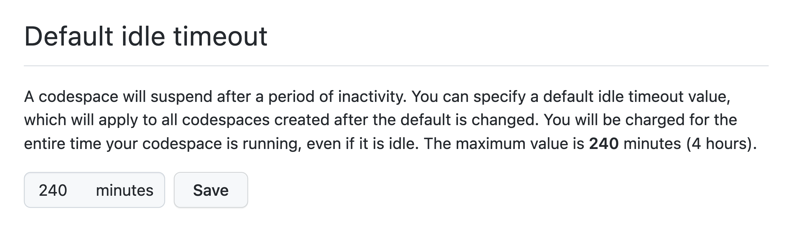
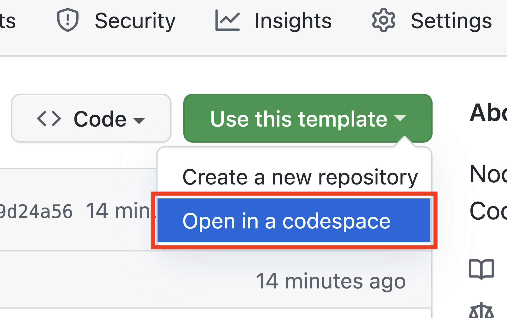
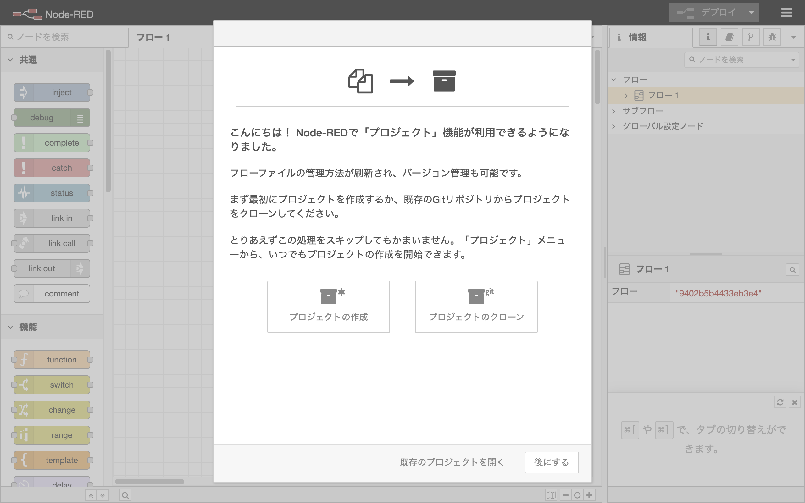

# GitHub Codespaces用のNode-REDテンプレート

このリポジトリは、GitHub CodespasesでNode-RED 環境を作成するためのテンプレートです。
Codespasesを使用すると、Node-REDフローエディタを一時的に4時間のみ使用できます。
このテンプレートは、ハンズオンイベントや個人的な使用のためにNode-REDを試すのに役立つでしょう。
以下は、このテンプレートの使用方法に関するステップバイステップの手順です。

## 1. GitHubアカウントを作成する

GitHubアカウントを持っていない場合は、以下のURLからGitHubアカウントを作成してください。

https://github.com/signup
   
アカウントに登録するには、メールアドレス、パスワード、ユーザー名などの情報を入力する必要があります。

## 2. GitHub Codespacesのタイムアウト時間を延長する

デフォルトでは、Codespacesが用意した環境は30分で終了します。
この期間はNode-REDフローを開発するには短すぎるため、ユーザの設定URLからタイムアウト時間を延長します。

https://github.com/settings/codespaces#default-idle-timeout-header

テキスト入力エリアに最大値の240分を入力します。

<kbd></kbd>

## 3. GitHub Codespacesに移動する

Node-REDテンプレートリポジトリにアクセスすると、右上隅に「Use this template」という緑色のボタンが表示されます。
このボタンをクリックすると、選択可能な2つのオプションが表示されます。
ここで「Open in a codespace」を選択して、Codespacesでテンプレートリポジトリを開きます。

## 4. Node-REDフローエディタを開く

約1分後、この環境は自動的にNode-REDをダウンロードして起動します。
Node-REDフローエディタを使用する準備が整うと、ダイアログが右下隅にポップアップ表示されます。

緑色のボタン「ブラウザーで開く」をクリックすると、ブラウザの別のタブが開き、Node-REDフローエディタが表示されます。
まず、この環境でプロジェクト機能のダイアログを開きます。
プロジェクトの構成をスキップするには、右下隅にある「後にする」ボタンをクリックします。

これで、Node-REDフローエディタですごいフローの開発を始めれるようになりました。
